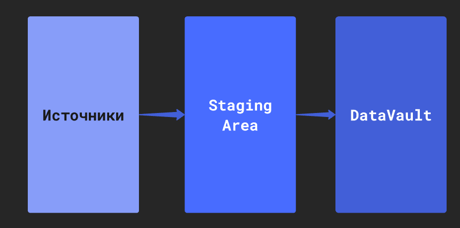

_Слои в Datapulse при разработке DataVault_

## Источники
В Datapulse источниками для DataVault являются модели dbt. Рекомендуется не использовать в качестве источников те модели, которые строятся над таблицами DataVault во избежания сложных зависимостей.

Выбрать в качестве источника DataVault просто таблицу или view, для которой нет файла модели dbt - **нельзя**!

## Staging area
Это отдельная схема данных, в которой формируются _технические_ таблицы для расчетов hash, hashdiff, констант и т.д. перед вставкой в DataVault.
Другими словами это некий промежуточный этап перед попаданием данных в таблицы DataVault.

Datapulse автоматически создает dbt модели для Staging area, поэтому пользователю не придется этого делать.

Тип у данных моделей автоматически проставляется view для того, чтобы они не занимали лишнее место на диске.
Но это накладывает одно небольшое ограничение!

⚠️ <b>Важно!</b> 

Так как модели Staging area - <code>view</code>, если источник (модель dbt) был изменен и тип у этого источника <code>view</code> или <code>table</code>, то dbt автоматически пересоздает его через <code>DROP CASCADE</code>.

Следовательно, это также удалит и <code>view</code> слоя Staging area, на основе которой строится DataVault

Но ничего страшного в этом нет, ведь данную <code>view</code> можно пересоздать, просто заново запустив модель dbt

Поэтому, если вы обновляете сущность или связь (набор хабов, сателлитов и линков в одном процессе), не используя Datapulse, не забывайте обновить и модели Staging Area!

## DataVault
Слой с таблицами DataVault.

