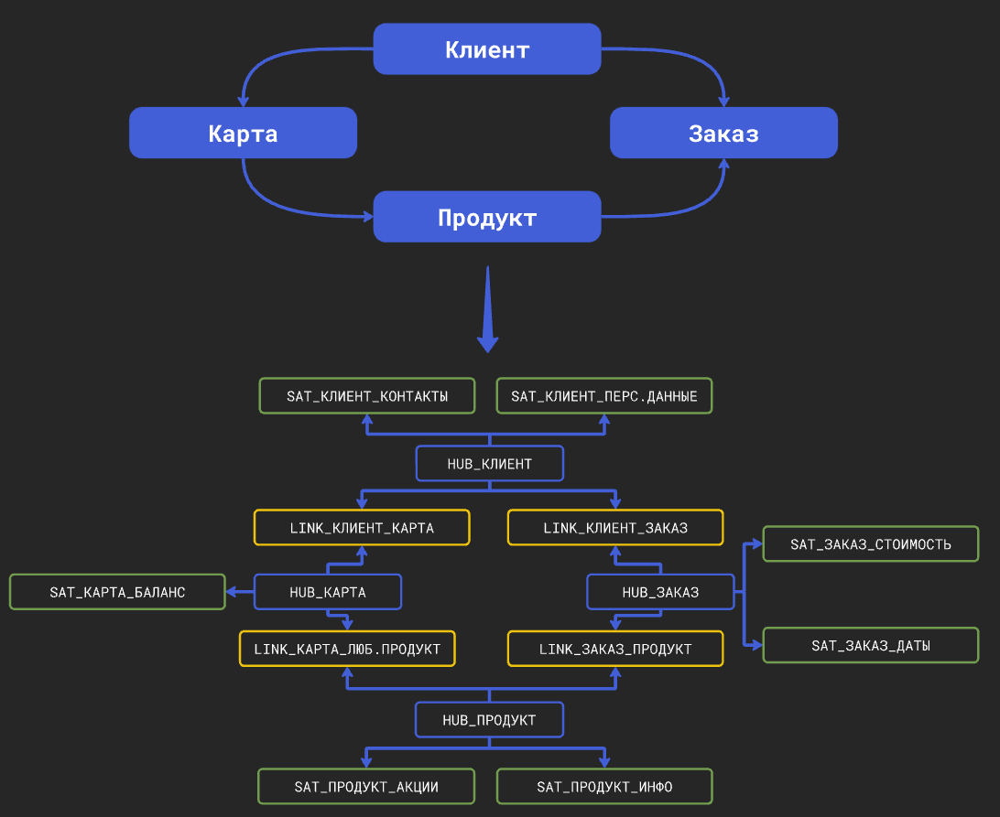
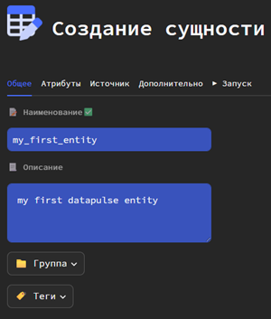
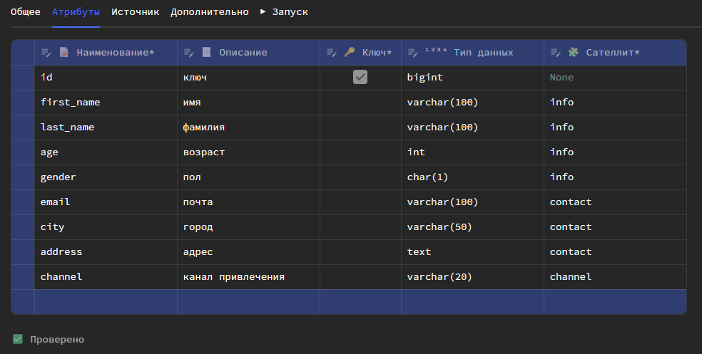
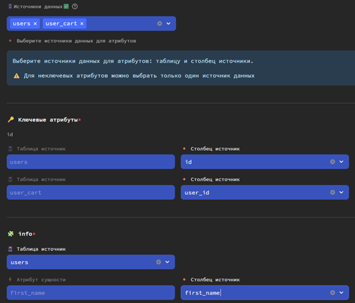
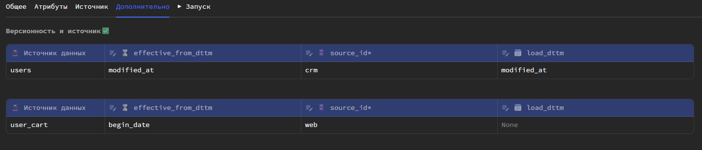

## Что такое сущность?
Сущность - логическое понятие для работы через Datapulse.
Сущность представляет собой объект реального мира (товар, клиент, заказ, транзакция), а "под капотом" у нее - hub и satellite.

Это значительно упрощает разработку DataVault, так как пользователю не требуется спускаться на уровень хабов и сателлитов, а нужно работать на уровне абстракции.
Datapulse на своей стороне генерирует необходимые таблицы.

## Создание сущности

### 1️⃣ Указание атрибутов

#### Общие параметры
Сперва укажите следующие общие параметры сущности: 

- наименование
- описание (опционально)
- группу
- теги

При указании группы и тегов, каждой таблицы сущности (hub, satellite), которая представляет собой модель dbt, будут присвоены указанные группа и теги.

##### Шаблоны имен
На основе наименования сущности будут формироваться имена таблиц hub и satellite.

**hub** - `hub_ИмяСущности`

**satellite** - `sat_ИмяСущности_ИмяСателлита`

##### Проверка имени 
Datapulse автоматически проверяет занято ли наименование сущности.
Но он не проверяет существуют ли hub и satellite с таким же наименованием. Поэтому если вы вручную создавали таблицы в DWH с такими наименованиями, они будут перезаписаны!

#### Атрибуты

Далее на вкладке **Атрибуты** укажите бизнес-атрибуты сущности. Указывайте только бизнес-атрибуты, которые описывают сущность! Технические атрибуты, такие как `EFFECTIVE_FROM_DTTM` (дата начала действия записи) или `SOURCE_ID` (код источника) будут сформированыв автоматически.
Про технические атрибуты более подробно смотрите [здесь](#anchor_tech_columns).

Опционально можете указать описания атрибутов для Data catalog.

Также укажите, какой атрибут (1 или несколько) будет являться натуральным ключом сущности. На основе этого ключа будет формироваться суррогатный ключ - hash.

После для каждого атрибута (кроме тех, которые входят в натуральный ключ!) укажите сателлиты.

##### Как выбрать натуральный ключ?

Натуральный ключ сущности - свойство, которое однозначно идентифицирует экземпляр сущности.

>Пример:
> 
>* клиент - номер паспорта
>* товар - SKU
>* заявка - номер заявки.

Конечно не всегда есть подобные данные. В таком случае, можно использовать ID системы источника - уникальный идентификатор, взятый из источника.

>Пример:
> 
>* клиент - ID клиента из CRM

Но в таком случае важно обязательно добавить в натуральный ключ код источника. Ведь, если у вас несколько источников, из которых вы берете клиентов (CRM + ERP), в разных системах у разных клиентов могут быть одни и те же значения ID!

| ID | ФИО                  | СИСТЕМА |
|----|----------------------|---------|
| 1  | Иванов Иван Иванович | 1C      |
| 1  | Петров Петр Петрович | CRM     |

Добавить константу кода источника потребуется в таблицу до создания сущности, чтобы потом выбрать добавленный столбец, как натуральный ключ.

##### Тип данных натуральног ключа
По умолчанию Datapulse сам определяет типы данных у атрибутов, если их не указать явно. 

Но в случаях, когда несколько источников грузятся в одну сущность, рекомендуется явно указывать тип данных у натурального ключа. 
Ведь в данный столбец будут загружаться значения из двух разных источников, которые могут быть с разными типами данных, что приведет к ошибке.

##### Как выбрать сателлит?
Сателлит - группа атрибутов сущности. Разбивать атрибуты можно по следующим критериям: 

- по смыслу (основная информация, контактные данные, маркетинговая информация - как на скрине выше)
- по частоте обновления (редко изменяемые атрибуты: номер паспорта, ФИО, дата рожения; часто изменяемые атрибуты: статус заявки, сегмент клиента)

### 2️⃣ Маппинг атрибутов
Далее выберите от 1 до N источников (моделей dbt), данные которых будут заполнять вашу сущность.
А после сопоставьте указанные ранее атрибуты сущности со столбцами выбранных источников.

По методологии DataVault в один сателлит вы можете грузить только один источник. Если вам требуется загружать несколько источников в один сателлит, потому что у вас несколько дублирующих логику источников, потребуется перед созданием сущности объединить две таблицы с помощью `UNION ALL`.

### 3️⃣ Настройки источника

На вкладке **Дополнительно** для каждого источника укажите следующие параметры: 

- `effective_from_dttm` - источник значений для даты и времени начала действия записи (scd-2 версионность). Если ничего не указано, при вставке новой строки будет записываться `current_timestamp`.
- `source_id` - код источника (любое текстовое значение, определяющее из какого источника получены данные).
- `load_dttm` - источник значений для столбца дата и время загрузки в таблицу. Если ничего не выбрано, будет записываться `current_timestamp`. 

⚠️ <b>Важно!</b> 

<code>load_dttm</code> также выступает столбцом инкрементом для инкрементальной загрузки в таблицу DataVault.

Поэтому если ничего не выбрано, каждый раз при обновлении таблицы DataVault будет полностью сканироваться весь источник, что может сказаться на времени обновления.

### 4️⃣ Настройка целевых таблиц
На той же вкладке **Дополнительно** вы можете настроить таблицы (хабы и сателлиты), которые будут созданы непосредственно в DWH.
Настройки таблиц детально описаны [здесь](../dbtmodel/extra_features.md#anchor_partition) и [здесь](../dbtmodel/dbtmodel.md#anchor_params).

## Технические столбцы
Datapulse автоматически формирует следующие технические столбцы в целевых таблицах: хабах и сателлитах.

### HUB

- `ИмяСущности_hk` - суррогатный ключ (hash на основе натурального ключа)
- `source_id` - код источника (константа, указанная пользователем)
- `load_dttm` - дата и время записи в таблицу

### SATELLITE

- `ИмяСущности_hk` - суррогатный ключ (hash на основе натурального ключа)
- `sat_ИмяСущности_ИмяСателлита_hashdiff` - hash на основе значений атрибутов сателлита (предназначается для определения изменений и записи новых версий)
- `effective_from_dttm` - дата и время начала действия записи
- `source_id` - код источника (константа, указанная пользователем)
- `load_dttm` - дата и время записи в таблицу

## Модели dbt
Во время создания сущности Datapulse автоматически генерирует модели dbt для хабов и сателлитов.

Все модели с типом `incremental` и incremental strategy - `append` (только вставка новых данных).

Дополнительно Datapulse генерирует dbt модели для staging area таблиц. О них и их предназначении более подробно [здесь](architecture.md).

## Дата окончания действия записи
По методологии DataVault в сателлитах нельзя хранить `effective_to_dttm` (дату и время окончания действия записи). Так как предполагается только вставка данных в таблицы (append), а наличие столбца `effective_to_dttm` предполагает операции `UPDATE`.

Чтобы пользователи каждый раз не писали оконные функции при обращении к сателлитам, Datapulse автоматически создает `view` над каждым сателлитом, которое является копией сателлита с добавлением столбца `effective_to_dttm`.

Наименование `view` - `sat_ИмяСущности_ИмяСателлита_v`