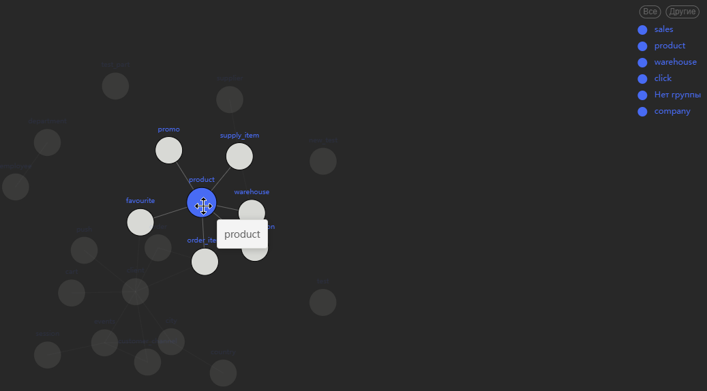

Модель данных может достаточно сильно разрастись, что ее будет сложно анализировать новым сотрудникам.

Для таких случаев в Datapulse реализован **граф связей**, который показывает связи между созданными сущностями.

Дополнительно вы можете исключать/оставлять конкретные группы сущностей из графа.

Наведя курсор на сущность, на графе будут подсвечены те сущности, которые связаны с первой.

