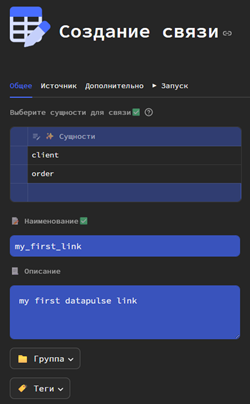
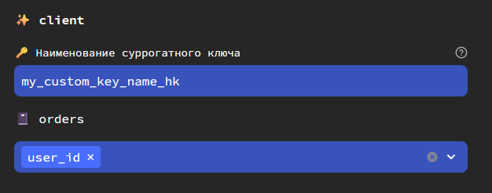
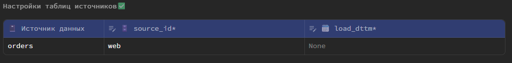

## Что такое связь?

Связь - это отдельная таблица (`link`), которая хранит в себе суррогатные ключи связанных сущностей.

С помощью данной таблицы можно переходить от одной сущности к другой. Связано может быть от 2 до N сущностей. А также связь может быть _многие-ко-многим_.

## Создание связи

#### 1️⃣ Указание источников

Сперва выберите от 2 до N сущностей, которые требуется связать.

Вы также можете связывать сущность с собой же (к примеру, сотрудник - начальник). Для этого нужно просто выбрать сущность два раза.

Далее задайте наименование сущности, ее описание, группу и теги.

Далее на вкладке **Источник** укажите от 1 до N источников (моделей dbt).

А после для каждой выбранной сущности и для каждого источника укажите от 1 до N столбцов, на основе которых будут формироваться суррогатные ключи.
Можно выбрать от 1 до N натуральных ключей.

Дополнительно вы можете указать наименование суррогатного ключа для конкретной сущности.
Это обязательно, если вы связываете сущность с собой же.

##### Шаблоны имен
На основе наименования связи будет формироваться имя таблицы link.

`link_ИмяСвязи`

#### 2️⃣ Настройки источника

Для каждого выбранного источника укажите следующее:
- `source_id` - код источника (любое текстовое значение, определяющее из какого источника получены данные).
- `load_dttm` - источник значений для столбца дата и время загрузки в таблицу. Если ничего не выбрано, будет записываться `current_timestamp`. 

⚠️ <b>Важно!</b> 

<code>load_dttm</code> также выступает столбцом инкрементом для инкрементальной загрузки в таблицу DataVault.

Поэтому если ничего не выбрано, каждый раз при обновлении таблицы DataVault будет полностью сканироваться весь источник, что может сказаться на времени обновления.

### 3️⃣ Настройка целевых таблиц
На той же вкладке **Дополнительно** вы можете настроить таблицу, которая будет создана непосредственно в DWH.
Настройки таблиц детально описаны [здесь](../dbtmodel/extra_features.md#anchor_partition) и [здесь](../dbtmodel/dbtmodel.md#anchor_params).

## Технические столбцы
Datapulse автоматически формирует следующие технические столбцы в целевой таблице.

- `Сущность1_..._СущностьN_hk` - суррогатный ключ связи
- `Сущность1_hk`...`СущностьN_hk` (или заданные пользователем наименования) - ссылки на сущности.
- `source_id` - код источника (константа, указанная пользователем)
- `load_dttm` - дата и время записи в таблицу

## Модели dbt
Во время создания сущности Datapulse автоматически генерирует модель dbt.

Модель с типом `incremental` и incremental strategy - `append` (только вставка новых данных).

Дополнительно Datapulse генерирует dbt модели для staging area таблиц. О них и их предназначении более подробно [здесь](architecture.md).

