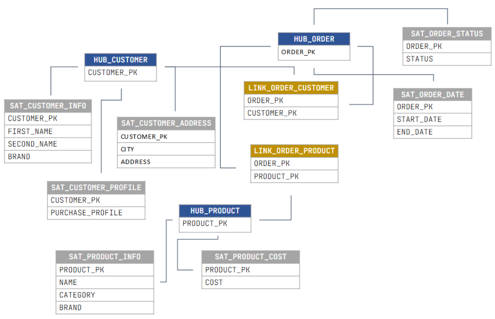

**Data Vault** — это способ построения хранилища данных, где информация разбивается на три типа таблиц:

1) **Хабы** — ключевые бизнес-сущности (например, клиенты, заказы)  
2) **Линки** — связи между ними  
3) **Сателлиты** — подробности и история изменений  

## Зачем использовать DataVault? 

**1. Долгосрочное хранение истории данных**  
Data Vault позволяет интегрировать и хранить данные из множества операционных систем, сохраняя полную историю изменений. Это дает возможность анализировать данные за весь период времени в рамках заданной области.  

**2. Аудит и отслеживаемость**  
Методология обеспечивает встроенный аудит и полную отслеживаемость данных, что критически важно для таких отраслей, как финансы, здравоохранение и образование. Вы всегда сможете получить исторические данные и понять, какая информация была доступна в конкретный момент времени.  

**3. Оптимизация загрузки**  
Data Vault разработан для быстрой загрузки больших объемов данных благодаря поддержке параллельной обработки. Это особенно важно при работе с крупными наборами данных, множеством источников и потоками в реальном времени, ускоряя получение аналитических инсайтов.  

**4. Масштабируемость**  
Модульная структура Data Vault позволяет легко масштабировать хранилище данных вместе с ростом бизнеса и быстро адаптироваться к новым требованиям.  

Главные плюсы:  
- Гибкость — легко добавлять новые данные без переделки всей структуры  
- Полная история — все изменения сохраняются  
- Устойчивость — если источник «сломается», данные не потеряются  

## Недостатки DataVault
У DataVault конечно же есть и недостатки, а именно: 

- много join, что сказывается на производительности запросов;
- чуть сложнее разобраться аналитикам в схеме

Но самый важный недостаток - <b>сложность разработки</b>

Если вы будете разрабатывать DataVault вручную, создавая pipelin-ы для hub, link и satellite, вы значительно увеличите время разработки (в сравнении с разработкой классической Звезды).
Приступать к DataVault без инструмента автоматизации - существенная ошибка!

## Автоматизация DataVault
Datapulse автоматизировал разработку DataVault 2.0. Пользователю остается только задать необходимые параметры сущности, после чего автоматически будет сформирован SQL для pipeline.

Это существенно снижает время разработки, а также риск ошибок. 

Дополнительно, ваши аналитики или data-инженеры будут разрабатывать DataVault, следуя стандартам. А также им не потребуется долгое время для изучения методологии DataVault, чтобы начать ее делать. 

Лучшем мы [покажем](entity.md)!