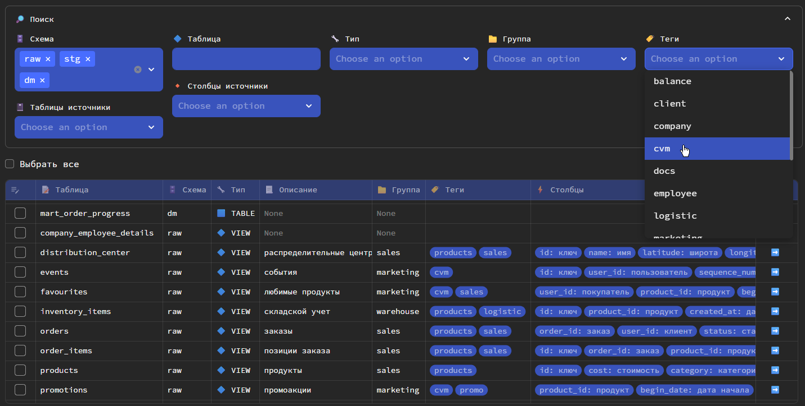
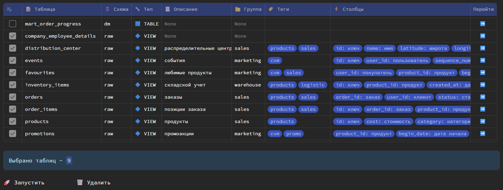
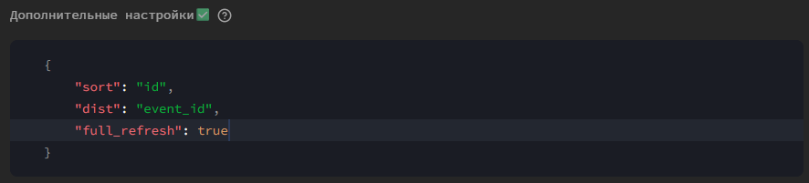
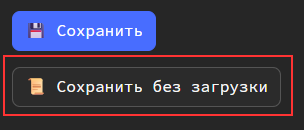

Процесс создания модели более подробно описан в [этом разделе](../quickstart.md).

## Data catalog
На основе dbt моделей, хранящихся в указанной в [параметре](../install.md#anchor_general) `dbt_project_path` папке dbt, автоматически формируется Data catalog с возможностью поиска по нему. 

_При этом dbt модель не обязательно должна была быть создана с использованием Datapulse_.

С помощью Data catalog можно массово запускать или удалять модели.

## Файлы моделей dbt
Файлы хранятся в папке проекта dbt в дочерней папке `/models`. Именно эту папку и все ее дочерние папки читает Datapulse для определения dbt моделей.

При создании новой модели Datapulse генерирует два файла:

1. `.sql` файл с SQL-запросом модели
2. `.yml` файл с параметрами модели

После генерации файлов Datapulse запускает модели, чтобы материализовать их в DWH.

## Группы и теги
У моделей dbt можно указывать группы и теги для возможности дальнейшего запуска моделей в рамках данных разделений. 

Также это удобно для разделения моделей по бизнес-подразделениям или бизнес-областям.

В интерфейсе Datapulse можно также указывать группы и теги для моделей, а потом использовать их непосредственно в dbt. 

## Параметры моделей

При создании моделей через Datapulse можно выбирать табличные параметры (unlogged, append-optimized и т.д.).
Но не все параметры, которые реализованы в dbt, учтены в интерфейсе Datapulse. Поэтому если вы не нашли нужного вам параметра в интерфейсе, можете просто указать его в json в разделе 

ℹ️ <b>INFO</b> 

По мере развития Datapulse параметры будут добавляться. На текущий момент добавлены только самые необходимые.

## Сохранение без запуска
Вы можете сохранять модели без запуска (только сохранить метаданные модели).

Для этого нажмите 

В этом случае будут созданы только файлы модели, а сама таблица в DWH создана не будет. 
Удобно в том случае, когда вам нужно создать несколько крупных моделей, которые могут долго обновляться, а также изменить модели в части описания, групп, тегов и т.д., что не повлияет на материализованный объект в DWH.

## Изменение модели
Для изменения модели перейдите из Data catalog в карточку модели и нажмите кнопку **Изменить**.

После вы можете изменить параметры модели или сам SQL-запрос.

### Изменение структуры таблицы
Если у таблицы добавились или удалились столбцы:

| Тип таблицы        | Сценарий                                                                                                                                                                                                                                                                                                                                                  |
|--------------------|-----------------------------------------------------------------------------------------------------------------------------------------------------------------------------------------------------------------------------------------------------------------------------------------------------------------------------------------------------------|
| `view`             | View будет пересоздана                                                                                                                                                                                                                                                                                                                                    |
| `table`            | Таблица будет пересоздана                                                                                                                                                                                                                                                                                                                                 |
| `incremental`      | Зависит от dbt параметра `on_schema_change`:  - `ignore` (default) - таблица не изменится - `fail` - будет выдана ошибка - `append_new_columns` - добавлять только новые столбцы - `sync_all_columns` - добавлять и удалять столбцы Параметр указывается ли в [самой модели](#anchor_params), либо в [файле проекта](../install.md#anchor_dbt_project). |

### Ограничения
Datapulse на текущий момент имеет ограничение, связанное с тем, что нельзя изменять технические параметры таблицы после ее создания.

## Удаление модели
Datapulse при удалении модели удаляет не только файла модели, но и саму таблицу в DWH.

ℹ️ <b>INFO</b> 

Datapulse не производит каскадного удаления таблиц/представлений в DWH (<code>drop cascade</code>)!

Поэтому, если от таблицы/представления зависит другой объект, будет выдана ошибка.

