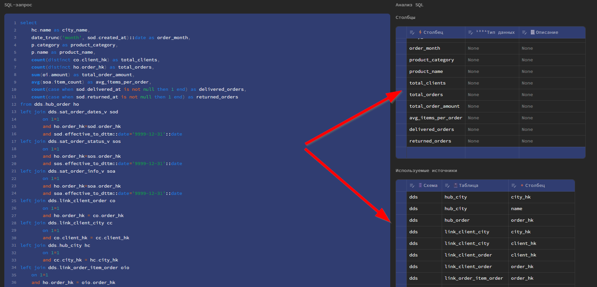
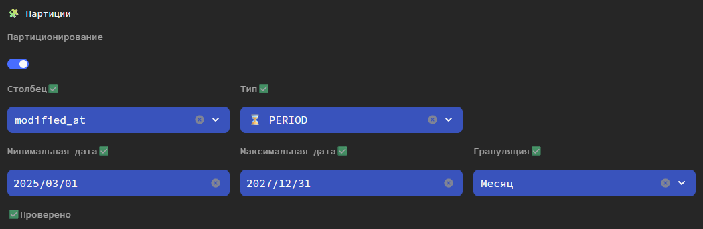

В Datapulse есть дополнительный функционал, которого нет в dbt.

## Анализ SQL запроса
Datapulse автоматически анализирует указанный SQL-запрос и определяет:

- список выходных столбцов
- список схем, таблиц и столбцов, которые указаны в SQL-запросе

Вы также можете корректировать результаты анализа.

Дополнительно, вы можете указывать типы данных для столбцов и их описание. 
При указании типов данных, будет происходить автоматическая конвертация.

## Партиции
В Datapulse можно создавать партиции для таблицы.
Партиции создаются перед созданием модели. Создавать или изменять партиции после создания таблицы в текущей версии Datapulse нельзя.

Доступны следующие типы партиций:

- `hash` (только для PostgreSQL)
- `period` (range партиция по диапазону дат)

ℹ️ <b>INFO</b> 

Партиции доступны только для типа <code>incremental</code>

Для создания партиции потребуется явно указать типы данных столбцов.

Настройки партиций указываются в разделе **Дополнительно**

