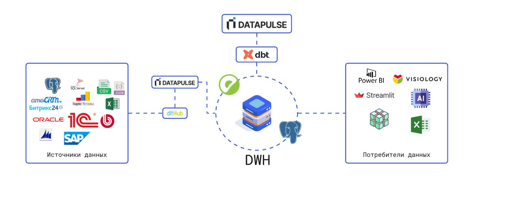

# Что такое Datapulse?

>**Datapulse** - это фреймворк для работы с хранилищем данных (DWH). Он поможет Вам собирать данные из различных источников, трансформировать их и применять лучшие практики.

Datapulse берет на себя многие технические задачи, позволяя вам сконцентрироваться только на бизнес-логике и сократить время на внедрение. Он значительно сокращает время разработки ETL-pipeline за счет автоматизации многих процессов, а также позволяет внедрять стандарты разработки и упрощает совместную работу над моделями данных.

Datapulse является надстройкой над хранилищем данных (DWH). Работает в паре с такими зарекомендовавшими себя на рынке инструментами, как dbt и dlt. 

## dbt

**dbt (data build tool)** — это инструмент для трансформации данных с помощью SQL, который позволяет применять принципы разработки ПО (тестирование, версионирование, модульность) в аналитике. С его помощью команды могут совместно работать над моделями данных, автоматизировать пайплайны и поддерживать единые бизнес-метрики.

В dbt нет графического (GUI) интерфейса, что усложняет его использование для не технических пользователей (data-аналитики). **Datapulse** является таким интерфейсом, а также имеет расширенный функционал.

## Datapulse упрощает процесс разработки

- Сокращает трудозатраты на разработку DWH
- Снижает порог входа (аналитики только со знанием SQL смогут разрабатывать модели данных и отчетные витрины)
- Легкая интеграция с другими инструментами (airflow, git  и т.д.)
- Элементарное внедрение (python-библиотека)

## Основные фичи Datapulse

Как пользователь, ваша основная задача — писать SELECT-запросы, которые реализуют бизнес-логику. 
Datapulse преобразует эти SELECT-запросы в таблицы или представления (views) в вашем хранилище данных.

| Фича                        | Описание                                                                        |
|-----------------------------|---------------------------------------------------------------------------------|
| **Материализация SQL**      | На основе вашего SELECT-запроса формирует обновляемые модели.                   |
| **Парсинг SQL**             | Парсит полученный SQL-запрос и автоматически формирует документацию.            |
| **Data catalog**            | Интерактивный data catalog.                                                     |
| **Модель данных DataVault** | Автоматическая генерация ETL для DataVault 2.0.                                 |
| **Качество данных**         | Широкий набор преднастроенных проверок качества данных                          |
| **Сбор данных**             | Широкие возможности по сбору данных из различных источников.                    |
| **Чат с DWH**               | Общение с DWH на основе естественного языка с использованием ИИ.                |

## Модули
Datapulse - модульный фреймворк. 

Ядром является конструктор моделей dbt. И есть модули, которые могут быть дополнительно подключены.

| Модуль                   | Описание                                                                   |
|--------------------------|----------------------------------------------------------------------------|
| ❄️ Конструктор DataVault | Low-code конструктор модели данных по методологии DataVault                |
| 📘 Экстрактор данных     | Low-code экстрактор данных из различных систем-источников (_в разработке_) |
| 🛡️ Качество данных       | Проверка качества данных над моделями dbt (_в разработке_)                 |
| 💎 Чат с DWH             | Отправка SQL-запросов к DWH с помощью естественного языка на основе ИИ (_в разработке_)    |