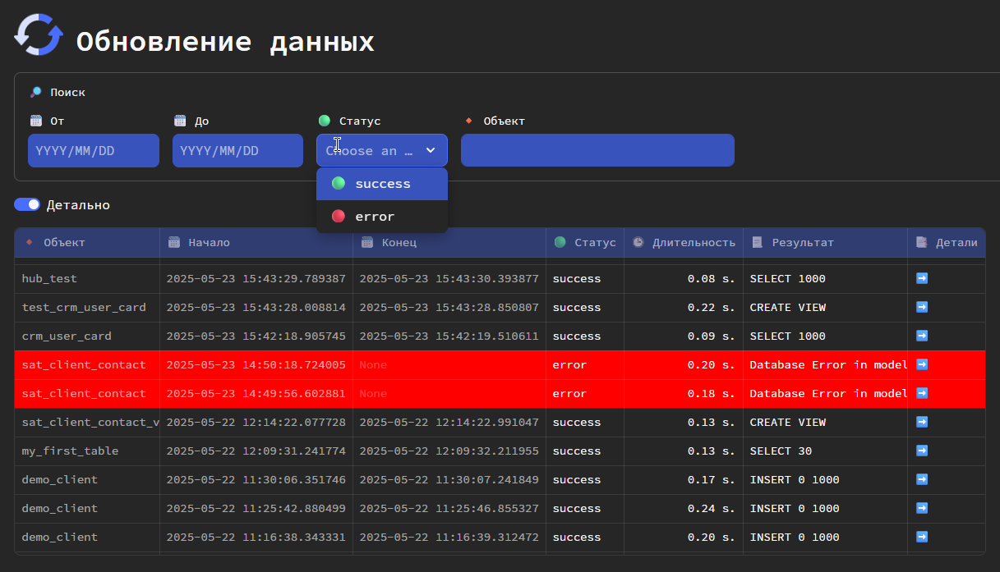
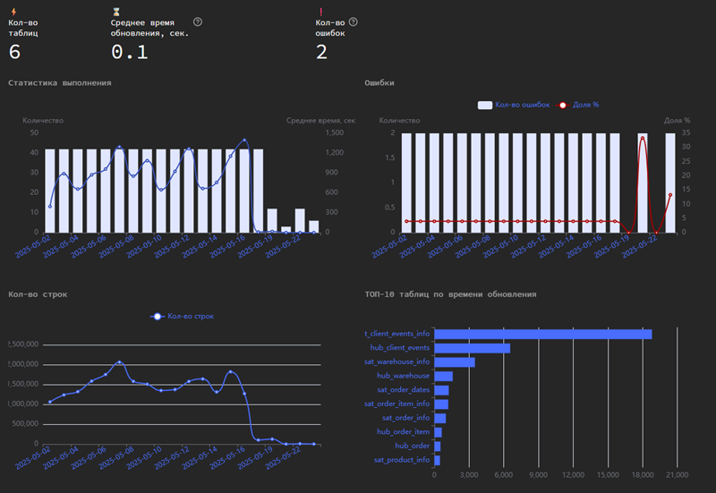
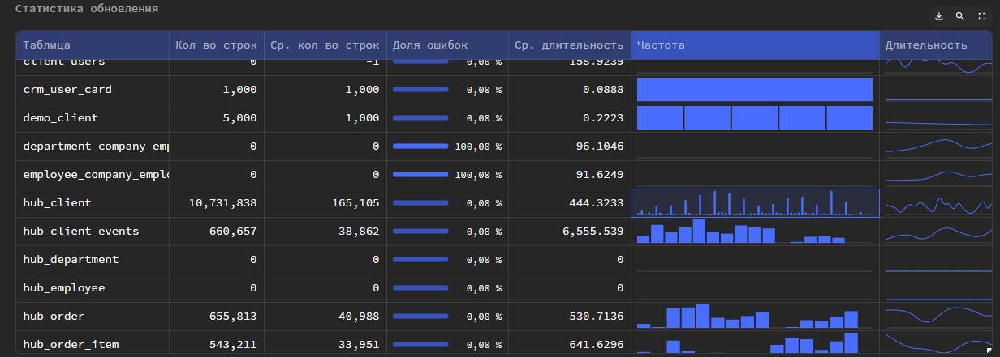

Datapulse автоматически логирует результаты запусков моделей dbt с фиксацией длительности обновления модели, ошибок и т.д.

Для включения логирования произведите дополнительную [установку](install.md#anchor_artifacts).

## Детальные логи
На вкладке **Обновление данных** предоставлен список ранее запущенных job-ов и статистика по ним.

> JOB -  процесс, в рамках которого были запущены одна или несколько моделей dbt.

Если установить **Детально**, то будут показаны логи детально до моделей dbt.
Дополнительно можно производить поиск по логам.

## Графическая статистика
Также DataVault на основе логов строит графический dashboard во вкладке **Статистика**

Дополнительно есть детальная статистика по каждой модели.

