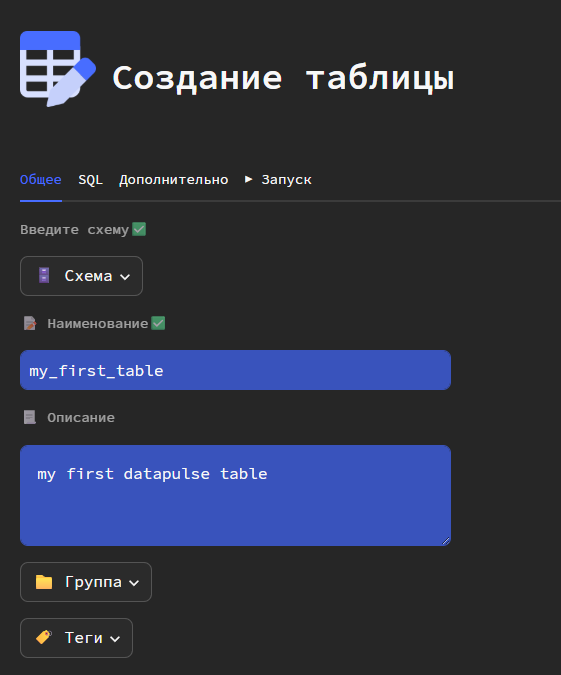
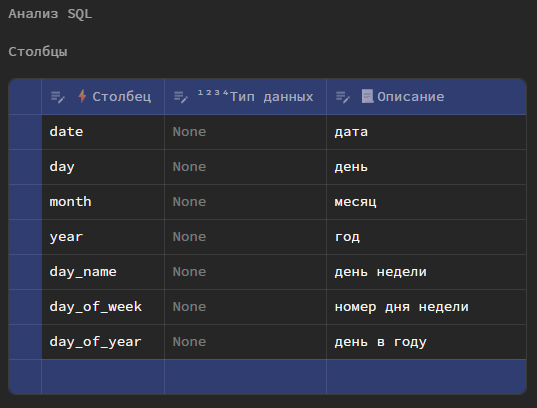
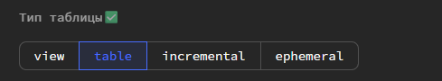
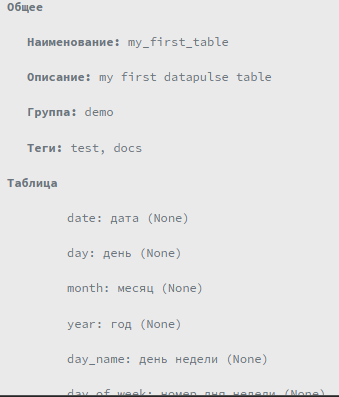
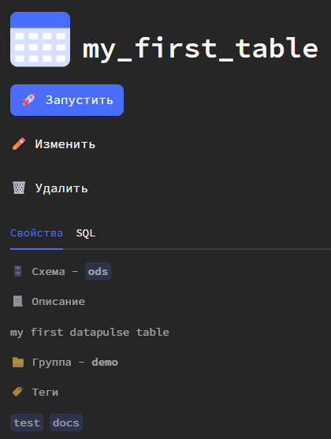
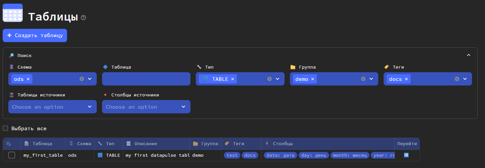
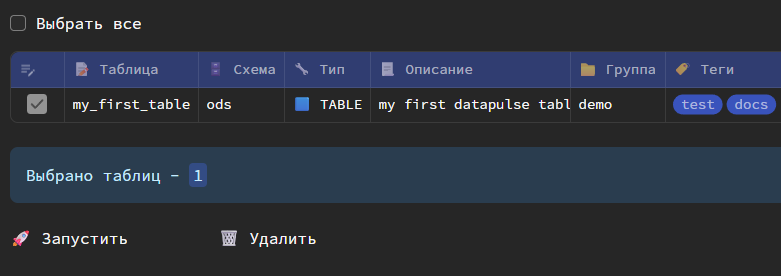
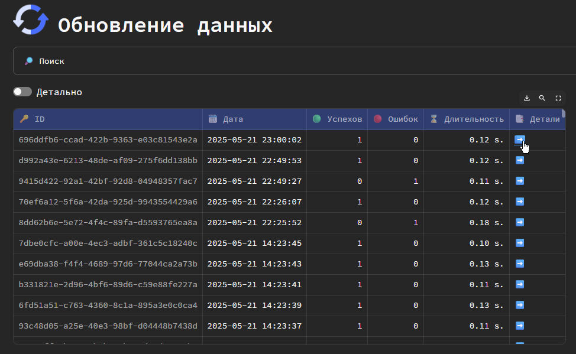
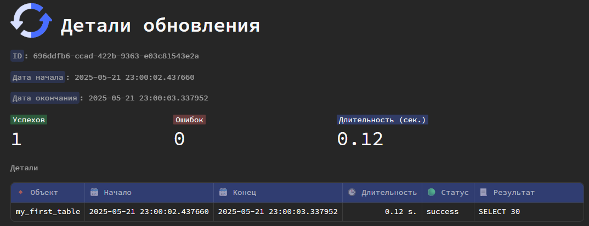

Убедитесь, что перед запуском выполнили все шаги из [инструкции по установке](install.md)

## 1️⃣ Запуск Datapulse
Выполните следующую команду в консоли
```bash
datapulse run
```
После в браузере автоматически откроется окно по адресу 
`http://localhost:8501/`
<div style="
    border-left: 4px solid #486DFF;
    padding: 12px 16px;
    margin: 16px 0;
    border-radius: 0 4px 4px 0;
">
ℹ️ <b>INFO</b> 
<p>При первом запуске streamlit (на основе которого реализован интерфейс) может попросить ввести email. Можно ввести любой символ и нажать Enter</p>
</div>

## 2️⃣ Создание первой модели dbt
Перейдите в раздел **Таблицы** и нажмите **Создать таблицу**.

В открывшемся окне укажите: 

* Схему (_если нет опций, введите вручную_)
* Наименование модели
* Описание (_не обязательно_)
* Группу (_не обязательно; если нет опций, введите вручную_)
* Теги (_не обязательно; если нет опций, введите вручную через запятую_)



Перейдите в раздел **SQL** и внесите ваш SQL-запрос.

_Пример SQL-запроса - календарь_

```sql
-- пример для PostgreSQL
WITH RECURSIVE calendar AS (
  -- Базовый случай: начинаем с текущей даты
  SELECT
    CURRENT_DATE AS date,
    EXTRACT(DAY FROM CURRENT_DATE) AS day,
    EXTRACT(MONTH FROM CURRENT_DATE) AS month,
    EXTRACT(YEAR FROM CURRENT_DATE) AS year,
    TO_CHAR(CURRENT_DATE, 'Day') AS day_name,
    EXTRACT(DOW FROM CURRENT_DATE) AS day_of_week,
    EXTRACT(DOY FROM CURRENT_DATE) AS day_of_year

  UNION ALL

  -- Рекурсивный случай: добавляем по одному дню
  SELECT
    CAST(date + INTERVAL '1 day' as date) as date,
    EXTRACT(DAY FROM date + INTERVAL '1 day'),
    EXTRACT(MONTH FROM date + INTERVAL '1 day'),
    EXTRACT(YEAR FROM date + INTERVAL '1 day'),
    TO_CHAR(date + INTERVAL '1 day', 'Day'),
    EXTRACT(DOW FROM date + INTERVAL '1 day'),
    EXTRACT(DOY FROM date + INTERVAL '1 day')
  FROM calendar
  WHERE date < CURRENT_DATE + INTERVAL '29 day' -- Останавливаемся через 30 дней
)

SELECT
  date,
  day,
  month,
  year,
  TRIM(day_name) AS day_name,
  CASE day_of_week
    WHEN 0 THEN 'Воскресенье'
    WHEN 1 THEN 'Понедельник'
    WHEN 2 THEN 'Вторник'
    WHEN 3 THEN 'Среда'
    WHEN 4 THEN 'Четверг'
    WHEN 5 THEN 'Пятница'
    WHEN 6 THEN 'Суббота'
  END AS day_of_week,
  day_of_year AS day_of_year
FROM calendar
ORDER BY date;
```
<div style="
    border-left: 4px solid #ffd700;
    padding: 12px 16px;
    margin: 16px 0;
    border-radius: 0 4px 4px 0;
">
⚠️ <b>Важно!</b> 
<p>Запрос должен быть SELECT-запросом (без INSERT, UPDATE, DELETE конструкций)</p>
<p>Не ставьте <code>;</code> в конце</p>
</div>

После нажмите кнопку **Запустить**. Будет выполнен парсинг SQL-запроса и определены выходные столбцы и таблицы и столбцы источники.
_В указанном примере, нет таблиц источников, поэтому ничего определено не будет._

Дополнительно вы можете указать типы данных и описания атрибутов. 
При указании типов данных, запрос будет в дальнейшем автоматически дополнен конструкциями `CAST()`



Далее в разделе **Дополнительно** выберите тип модели.



И после в разделе **Запуск** сперва проверьте параметры создаваемой модели, раскрыв блок **Проверка**



И нажмите кнопку **Сохранить**.

Таблица будет создана в DWH в указанной схеме.

## 3️⃣ Карточка модели
Перейдите в карточку модели по кнопке, появившейся после создания.


## 4️⃣ Data catalog

Вернитесь в раздел **Таблицы**. В реестре вы увидете созданную таблицу. Ее также можно будет находить (если моделей много) по встроенному поиску.



Выберите в таблице созданную модель и нажмите появившуюся кнопку **Запустить**.



В открывшемся окне нажмите **Да** и дождитесь сообщения об успешном обновлении.

## 5️⃣ Просмотр логов
Перейдите в раздел Обновление данных и увидите список запущенных ранее процессов обновления dbt моделей.
Перейдите в **Детали** последнего.


В открывшемся окне увидите детали и результаты обновления модели.

