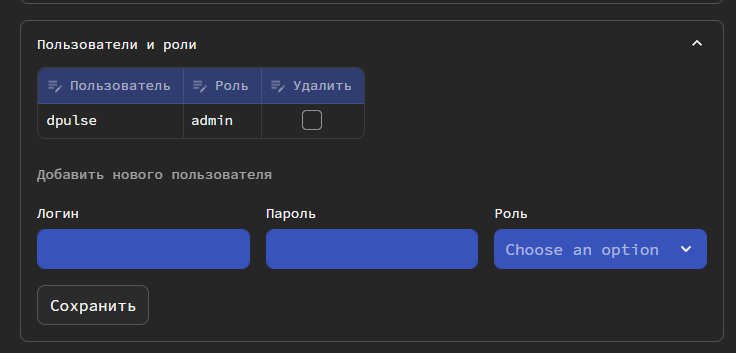

## Пользователи
В Datapulse предусмотрено многопользовательская работа и аутентификация. 

Для задания пользователей и их ролей сперва установите параметр `disable_auth: false` в конфигурационном файле Datapulse.
Подробнее [здесь](install.md#anchor_general). При изменении параметров требуется перезагрузить Datapulse.

После на странице **Настройки** у вас появится раздел **Пользователи** (он доступен только администраторам).

В Datapulse предусмотрены три роли. У каждой роли есть разные привилегии.

| Модуль                  | ADMIN | DEVELOPER | ANALYST |
|-------------------------|-------|-----------|---------|
| Модели dbt              | 
<input type="checkbox" checked disabled>
 |
<input type="checkbox" checked disabled>
          | 
<input type="checkbox" checked disabled>
      |
| Конструктор DataVault   | 
<input type="checkbox" checked disabled>
 |
<input type="checkbox" checked disabled>
          | 
<input type="checkbox" disabled>
       |
| Экстрактор данных       | 
<input type="checkbox" checked disabled>
 |
<input type="checkbox" checked disabled>
          | 
<input type="checkbox"  disabled>
      |
| Качество данных         | 
<input type="checkbox" checked disabled>
 |
<input type="checkbox" checked disabled>
          | 
<input type="checkbox" checked disabled>
      |
| Чат с DWH               | 
<input type="checkbox" checked disabled>
 |
<input type="checkbox" checked disabled>
          | 
<input type="checkbox" checked disabled>
      |
| Логи и статистика       | 
<input type="checkbox" checked disabled>
 |
<input type="checkbox" checked disabled>
          | 
<input type="checkbox" checked disabled>
      |
| Настройка пользователей | 
<input type="checkbox" checked disabled>
 |
<input type="checkbox" disabled>
           | 
<input type="checkbox" disabled>
       |