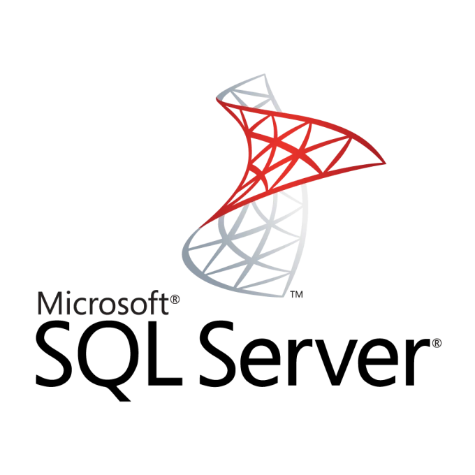

Datapulse является надстройкой над СУБД, которое выступает в качестве хранилища данных (DWH).

Поддерживаемые СУБД:

|                                                           | СУБД       | Поддерживается | Комментарий                                           |
|-----------------------------------------------------------|------------|----------------|-------------------------------------------------------|
| { width="50" }   | PostgreSQL |
<input type="checkbox" checked disabled>
|                                                       |
| { width="100" } | PostgrePro |
<input type="checkbox" checked disabled>
|                                                       |
| { width="50" }   | Greenplum  |
<input type="checkbox" checked disabled>
|                                                       |
| { width="50" }   | Arenadata  |
<input type="checkbox" checked disabled>
|                                                       |
| { width="50" }   | MSSQL      |
<input type="checkbox"  disabled>
| В планах.                                             |
| { width="50" }   | Clickhouse |
<input type="checkbox"  disabled>
| В планах. Конструктор DataVault доступен не будет |
